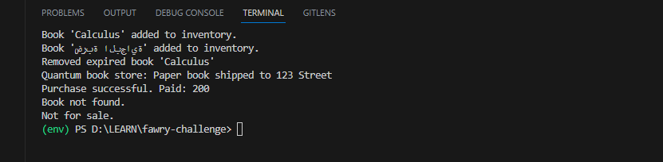

## Features

- Add different types of books to the inventory:
  - 📦 **Paper Book** – has stock and can be shipped
  - 💾 **EBook** – has a filetype and can be sent via email
  - 📖 **Showcase Book** – for display only, not for sale
- Remove outdated books based on their publication year
- Buy books using ISBN, with email and shipping address
- Extensible design for adding new product types easily

## Project Structure
- main.py # Demo test class and entry point to run the test
- book.py # Book class and its types
- book_sending.py # Simulated shipping and email services
- store.py # Bookstore logic

